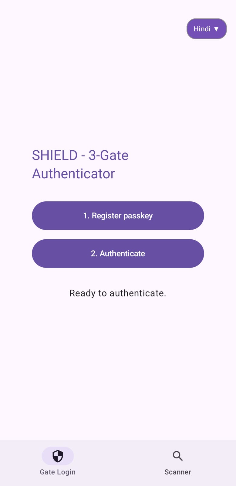
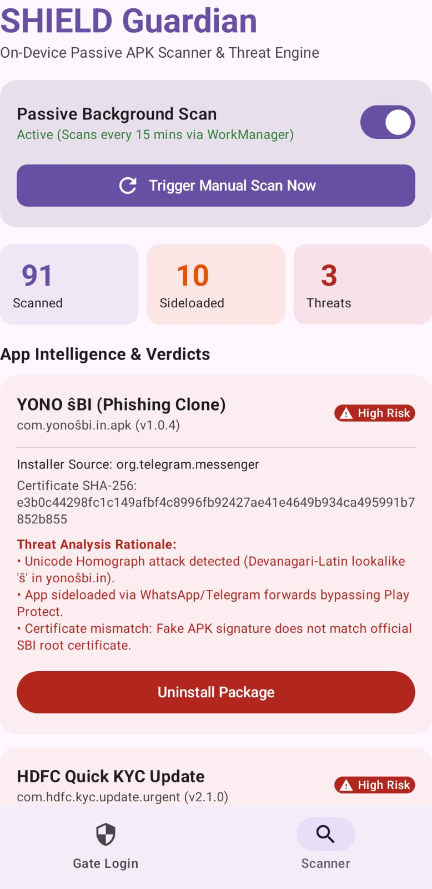

# SHIELD: Secure Heuristics, Intelligence, Education, and Live Detection

### 🛡️ SBI Finnovation Hackathon 2026 Submission
**Team Name:** PhishKillers (IIT Jodhpur)  
**Team Members:** Ved Mitra Verma, Aditya Sharma

---

## Project Overview
SHIELD is a cloud-native, five-layer, cross-platform security system designed to defend State Bank of India's digital banking ecosystem (YONO) against malicious "look-alike" phishing applications distributed via side-loading and social engineering vectors. 

By unifying hardware-rooted app attestation, real-time machine learning, and zero-cost open-source infrastructure, SHIELD shifts banking security from reactive blacklisting to proactive mathematical certainty.

---

## System Architecture (Mobile App & Client Defense)
				┌────────────────────────┐
                │   L0: Threat Origin    │ (SMS Smishing, WhatsApp Clones, Fake Store APKs)
                └───────────┬────────────┘
                            │
                ┌───────────▼────────────┐
                │  L1: Perimeter Defense │ (ONNX MobileBERT URL Engine, Unicode Homograph Detector)
                └───────────┬────────────┘
                            │
                ┌───────────▼────────────┐
                │   L2: Device Defense   │ (Kotlin Multiplatform App, WorkManager Passive Scanner)
                └────────────────────────┘
                
---

## Application Preview

<table>
  <tr>
    <td></td>
    <td></td>
  </tr>
</table>

---

## Module Ownership & Work Division

### 1. URL Risk Engine (`/core-ml`)
* **Owner:** Aditya Sharma
* **Tech Stack:** Kotlin, Hugging Face (MobileBERT), ONNX Runtime, Ktor Client.
* **Responsibilities:**
  * Executed **ONNX INT8 format** MobileBERT inference to process and score pasted URLs directly on local mobile clients.
  * Engineered a custom algorithm to isolate and flag **Devanagari-Latin Unicode homograph** attacks.
  * Implemented telemetry reporting via **Ktor (`UrlReportClient`)** utilizing strict `withTimeout(5000L)` bounds to prevent `GlobalScope` memory leaks when the backend is offline.
  * Fixed Android 11+ **Package Visibility limitations** by using `PackageManager.MATCH_ALL` to ensure the "Proceed to Browser" safety intercept breaks out of the default app infinite loop.

### 2. Three-Gate Login & Client Foundation (`/mobile-kmp`)
* **Owner:** Ved Mitra Verma
* **Tech Stack:** Kotlin Multiplatform (KMP), Compose Multiplatform, Coroutines.
* **Responsibilities:**
  * Built the unified mobile client codebase targeting dual-platform native runtimes from a single framework.
  * Structured the UI state for the **Three-Gate authentication pipeline** (Device Attestation, mTLS, FIDO2) using `rememberCoroutineScope()`.
  * Engineered a custom lightweight **Compose Multiplatform Language Dropdown** bypassing broken/missing Material 3 widget dependencies in `commonMain` while maintaining perfect z-index layout hierarchy.

### 3. Passive APK Live Scanner (`/android-watchdog`)
* **Owner:** Aditya Sharma
* **Tech Stack:** Kotlin, Android SDK, Android Jetpack WorkManager, SharedPreferences.
* **Responsibilities:**
  * Implemented a background-persistent **WorkManager service (`ScannerWorker`)** running within the native `androidMain` multiplatform lifecycle.
  * Engineered **SharedPreferences persistence** for the scanner's toggle state (`MainScreenViewModel`), ensuring user preferences survive RAM clears and app restarts.
  * Evaluated installed apps against unauthorized bank brand variations (synthetic demo threats).

### 4. Multi-Lingual Threat Alarm System (`/audio-alerts`)
* **Owner:** Ved Mitra Verma
* **Tech Stack:** Kotlin, Android MediaPlayer, Local MP3 Assets.
* **Responsibilities:**
  * Engineered a zero-latency **Multi-Lingual Audio Alarm System**, playing back pre-recorded regional language warnings (`.mp3` local assets) via `MediaPlayer` inside a Compose `DisposableEffect` loop.
  * This automatically triggers infinitely looping voice alerts in the user's selected regional language whenever a URL is flagged as **HIGH** or **CRITICAL** risk, ensuring accessibility for non-technical or visually impaired users.

---

## Complete Technical Stack

| Domain | Component Stack |
| :--- | :--- |
| **Mobile Frontend** | Kotlin Multiplatform (KMP), Compose Multiplatform, Coroutines |
| **Networking & Auth** | Ktor Client, Play Integrity API, FIDO2/WebAuthn Constraints |
| **On-Device ML** | Hugging Face MobileBERT, ONNX Runtime (C++ Bindings) |
| **Background Services** | Android Jetpack WorkManager, SharedPreferences |
| **Localization** | Android MediaPlayer, Pre-recorded MP3 Assets |

---

## Setup & Installation

### Prerequisites
* **Android Development:** Android Studio Hedgehog+, JDK 17
* **iOS Compilation:** macOS environment with Xcode 16+ and iOS 18.0+ deployment target.

### Network Configuration (Important)
Before compiling, you must update the hardcoded backend IP addresses to point to your local machine (or `10.0.2.2` if using the Android Emulator). Update the IP in the following files:
* `shared/src/androidMain/kotlin/org/example/shield/gate/Constants.kt`
* `shared/src/commonMain/kotlin/org/example/shield/scanner/url/UrlReportClient.kt`

### Gate-2 mTLS Setup (Local Development)
To test Gate-2 locally, you must generate a mock client certificate (`client.p12`) and place it in the Android resources directory. The app expects the keystore password to be `"password"`.

Run the following terminal commands to generate the certificate:

```bash
# 1. Create the raw res directory if it doesn't exist
mkdir -p androidApp/src/main/res/raw

# 2. Generate a new private key and a self-signed certificate
openssl req -x509 -newkey rsa:2048 -keyout client.key -out client.crt -days 365 -nodes -subj "/CN=shield-client-dev"

# 3. Bundle the key and certificate into a PKCS12 format (.p12) with password "password"
openssl pkcs12 -export -out androidApp/src/main/res/raw/client.p12 -inkey client.key -in client.crt -passout pass:password

# 4. Clean up the intermediate files
rm client.key client.crt
```
Once the IP addresses are updated and the `client.p12` file is in `androidApp/src/main/res/raw/`, you can build and run the app.

### Building the Project
Simply open the project directory in Android Studio and run a gradle sync. To build the debug APK:
```bash
./gradlew :androidApp:assembleDebug
```
